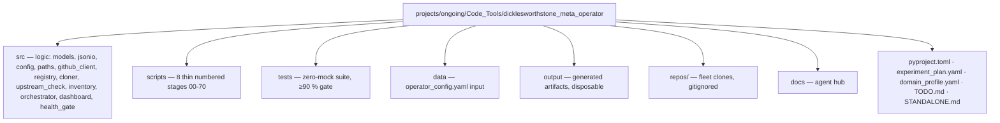

# Code Project — Dicklesworthstone Corpus Meta-Operator

**This is an active project** in `projects/ongoing/Code_Tools/`. It is a
meta-operator over the [Dicklesworthstone](https://github.com/Dicklesworthstone)
GitHub corpus: enumerate, clone, verify upstream sync, orchestrate, interpret,
dashboard, gate.

## Layer contract

| Surface | Rule |
| --- | --- |
| `src/models.py`, `src/jsonio.py`, `src/config.py`, `src/project_paths.py` | Frozen contract: pure models + artifact I/O + typed config + path resolution. No subprocess. |
| `src/github_client.py` | Subprocess boundary (`gh`); parsing is pure (`parse_repos`). |
| `src/cloner.py`, `src/upstream_check.py`, `src/inventory.py`, `src/orchestrator.py`, `src/dashboard.py`, `src/health_gate.py` | Importable workflow modules: explicit I/O (git, filesystem, HTML), pure decision logic kept separable. |
| `scripts/` | Thin orchestrators: argv parsing + delegation to `src/` + artifact writes. No business logic. |
| `output/` | Disposable generated artifacts. Never edit; regenerate. |
| `data/` | Versioned inputs only (`operator_config.yaml`). No generated JSON. |
| `repos/` | Fleet clones — gitignored, never tracked, never scanned by tests. |

Enforced by review; the boundary test: if a line in `scripts/` decides what to
run or how to classify a repo, it belongs in `src/` behind a test.

## Protocol for AI agents

Before modifying this project:

1. Read `docs/agent_instructions.md` (operational constraints).
2. Read `docs/testing_philosophy.md` before writing or touching any test — zero-mock is a hard rule (`unittest.mock`/`MagicMock`/`@patch`/`create_autospec` are forbidden; real temp git fixtures instead; `pytest.MonkeyPatch` only on module attributes for error paths).
3. Read `docs/architecture.md` before changing module boundaries.

## Testing

```bash
# From the project directory (canonical gate):
uv run pytest tests/ --cov=src --cov-fail-under=90 -q
# From the monorepo root (CI parity):
uv run pytest projects/ongoing/Code_Tools/dicklesworthstone_meta_operator/tests/ \
  --cov=projects/ongoing/Code_Tools/dicklesworthstone_meta_operator/src --cov-fail-under=90
```

A green exit code alone is not proof: confirm tests collected > 0 and coverage
≥ 90 %.

## Vocabulary contract

`src/models.py` fixes the cross-module state vocabularies (`CloneOutcome.status`,
`UpstreamStatus.state`, `AUTO_COMMAND_KEYS`, `UPSTREAM_OK_STATES`). The dashboard,
health gate, and reports consume these strings; do not rename them locally.

## JSON artifact shapes

Cross-module artifact shapes are fixed in the builder contract embedded in
`docs/architecture.md`. Producers: scripts 10/20/30/40/50/70; consumers:
scripts 50/60/70 and the dashboard.

## Directory map


