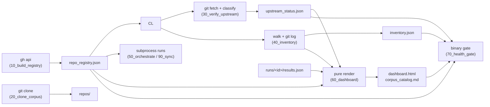

# Methodology {#sec:methodology}

## System architecture {#sec:architecture}

The operator is a pipeline of nine numbered stages over twelve typed modules. Communication between modules is **artifact-mediated**: workflow modules never import each other; they exchange data through JSON artifacts under `output/data/` with fixed shapes. This is what keeps every stage independently re-runnable and every module independently testable.

The four contract modules (`src/models.py`, `src/jsonio.py`, `src/config.py`, `src/project_paths.py`) are frozen: pure dataclasses with fixed state vocabularies, atomic JSON I/O, typed configuration, and path resolution. Workflow modules (`github_client`, `registry`, `cloner`, `upstream_check`, `inventory`, `orchestrator`, `dashboard`, `figures`, `manuscript_variables`, `health_gate`) import only the contract modules.

## Upstream-verification formalism {#sec:verification-formalism}

For a clone $r$ with upstream default branch $d(r)$, define the verification state as a priority-ordered classification evaluated over cheap git queries (`rev-parse`, `symbolic-ref`, `status --porcelain`, `rev-list --left-right --count`):

$$
\operatorname{state}(r) \;=\;
\begin{cases}
\texttt{missing}   & \text{no clone, or path is not a repository} \\
\texttt{unborn}    & \text{no commit at HEAD, HEAD is symbolic} \\
\texttt{detached}  & \text{HEAD is not a symbolic ref} \\
\texttt{dirty}     & \text{worktree has uncommitted or untracked changes} \\
\texttt{off\_default} & \text{checked-out branch } \neq d(r) \\
\texttt{diverged}  & \text{ahead} > 0 \,\wedge\, \texttt{behind} > 0 \\
\texttt{behind}    & \text{behind} > 0 \\
\texttt{ahead}     & \text{ahead} > 0 \\
\texttt{on\_upstream} & \text{HEAD} = \operatorname{origin}/d(r) \text{ and clean}
\end{cases}
$$ {#eq:state_machine}

The derivation order matters: dirtiness shadows branch alignment (a dirty worktree on the default branch still computes alignment information in `on_upstream_default`, but its state is `dirty`), and detachment is checked before dirtiness because `symbolic-ref` fails wholesale on a detached HEAD. An empty upstream clones to a local repository with no commits — state `unborn`, which counts as in-sync: there is nothing upstream to be behind.

The **primary metric** of [@eq:sync_ratio] is then the fraction of the corpus whose state lands in $\mathcal{OK}$.

## Smart fetch {#sec:smart-fetch}

Full-fetch verification costs a network round trip and object transfer per repository. The **smart-fetch** procedure reduces steady-state cost to probes while provably retaining drift detection:

1. **Offline pass.** Classify every clone from cached refs (no network). Repositories not in $\mathcal{OK}$ are marked for re-verification with fetch.
2. **Tip probe.** For each clean repository, run `git ls-remote origin refs/heads/$d(r)$` — a single small network exchange. If the remote tip differs from the locally cached `origin/$d(r)$` ref, the repository has moved upstream and is marked for fetch.
3. **Fetch pass.** Re-verify all marked repositories with a full `git fetch`, overwriting their offline classification.

The offline pass alone cannot detect upstream movement on a clean clone (its cached ref equals HEAD regardless of the true tip); the tip probe closes exactly that hole. A synced corpus therefore costs one `ls-remote` per repository — no object transfer — while still reporting every drifted clone as `behind`.

## Interpretability inventory {#sec:inventory-formalism}

Each clone $r$ yields a profile with source counting defined by

$$
L(r) \;=\; \sum_{f \in F(r)} \min\bigl(\operatorname{lines}(f),\; \texttt{cap}\bigr), \qquad \texttt{cap} = 20000
$$ {#eq:loc_count}

where $F(r)$ is the set of regular files outside a fixed skip-set (`.git`, `node_modules`, build artifacts, lockfiles) with recognized source extensions, read binary-safely. Line capping bounds the influence of generated monsters on aggregate statistics. Language aggregation keys on file extensions through a fixed, documented map; the primary language of a repository is the extension with maximum line count, ties broken alphabetically for determinism.

Entry points, manifests, and per-repository auto-detected commands (`test`, `lint`, `typecheck`) are detected from a fixed candidate list with documented precedence (Cargo.toml > pyproject.toml > package.json > go.mod > Makefile), so orchestration selectors can route work without re-inspecting each repository.

## Binary health gate {#sec:gate-formalism}

The health gate is a conjunction of binary checks over the artifact tree,

$$
\operatorname{gate}(T) \;=\; \bigwedge_{c \in C} c(T)
$$ {#eq:gate}

where $T$ is the tree state and $C$ covers registry presence and count, clone completeness, upstream sync (every state in $\mathcal{OK}$), inventory coverage, figure presence, dashboard/catalog presence, and advisory run presence. Every check emits a `GateCheck(check_id, passed, detail)`; the aggregate `GateReport` is persisted to `output/data/health_gate.json` and rendered as the GO/NO-GO verdict on the dashboard. A failing check is a deliberate boundary, not a skipped success: each carries a fix hint naming the script to run.