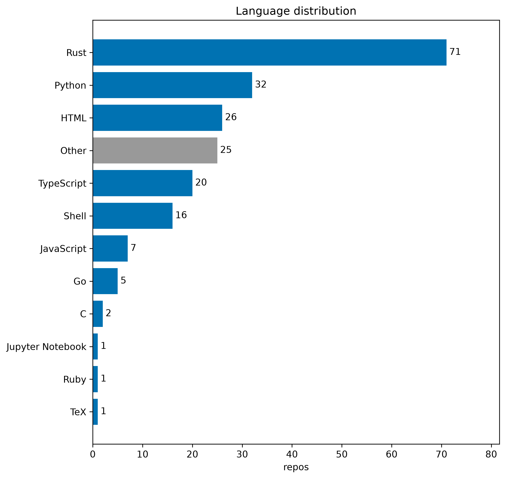
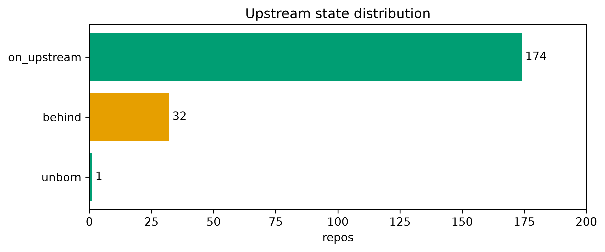
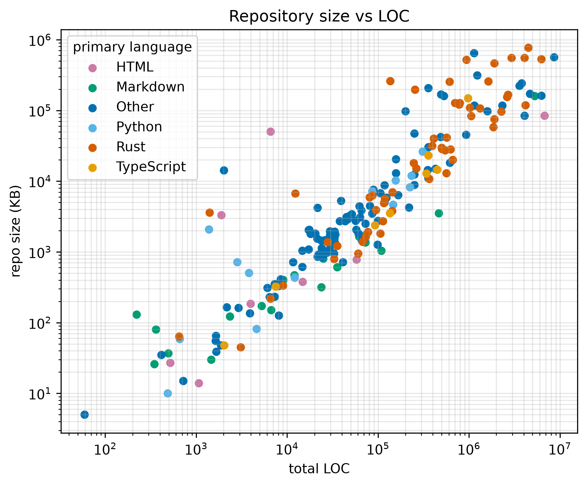
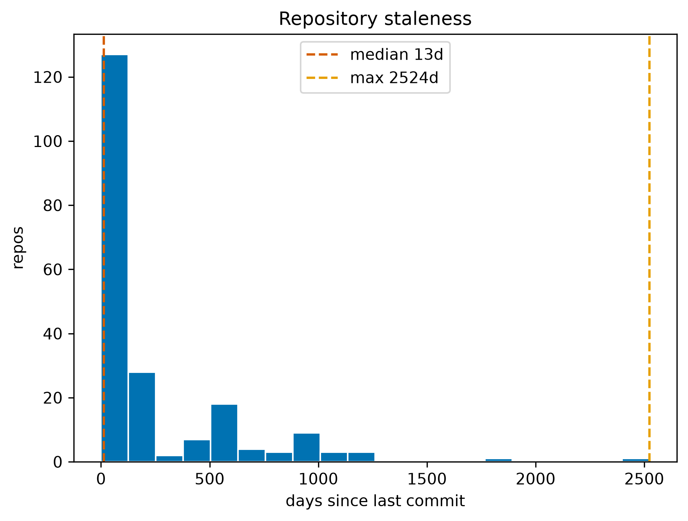

# Results {#sec:results}

All numbers in this section are placeholders hydrated from the tracked artifacts of the captured snapshot; the artifact SHA-256 prefixes that pin the exact evidence are recorded in [@sec:reproducibility].

## Corpus composition {#sec:corpus-composition}

The registry enumerates {{CORPUS_REPO_TOTAL}} repositories of user {{CONFIG_GITHUB_USER}}, of which {{CORPUS_FORK_TOTAL}} are forks of third-party projects (flagged in the registry and excludable by selector; the captured configuration includes them) and {{CORPUS_ARCHIVED_TOTAL}} are archived. The corpus spans {{CORPUS_LANG_COUNT}} primary languages, totalling {{CORPUS_TOTAL_LOC}} counted source lines.

| Rank | Language | Repositories |
|---|---|---|
| 1 | {{CORPUS_LANG1_NAME}} | {{CORPUS_LANG1_COUNT}} |
| 2 | {{CORPUS_LANG2_NAME}} | {{CORPUS_LANG2_COUNT}} |
| 3 | {{CORPUS_LANG3_NAME}} | {{CORPUS_LANG3_COUNT}} |
| 4 | {{CORPUS_LANG4_NAME}} | {{CORPUS_LANG4_COUNT}} |
| 5 | {{CORPUS_LANG5_NAME}} | {{CORPUS_LANG5_COUNT}} |
| — | remaining {{CORPUS_LANG_COUNT}} − 5 languages | {{CORPUS_LANG_OTHER_REPOS}} |

: Primary-language distribution of the enumerated corpus {#tbl:languages}

[@fig:languages] renders the full distribution; the long tail beyond the top five is dominated by single-repository languages ([@tbl:languages]).

{#fig:languages width=78%}

Interpretability coverage is broad: {{CORPUS_CI_WORKFLOWS}} repositories carry GitHub Actions workflows, {{CORPUS_CARGO_MANIFESTS}} declare a `Cargo.toml`, and {{CORPUS_PYPROJECT_MANIFESTS}} declare a `pyproject.toml`. {{CORPUS_WITH_TESTS}} repositories ({{CORPUS_WITH_TESTS_PCT}} %) expose a detectable test layout, each with a per-repository auto-detected command that the orchestrator can route directly.

## Upstream synchronization {#sec:upstream-results}

Fleet synchronization is a single `git pull --ff-only` pass: fast-forward-only semantics can never create a merge commit, so the clones remain pure mirrors. At the captured sync run, all pull-eligible repositories succeeded; repositories with unborn HEADs (empty upstreams — {{VERIFY_UNBORN}} in this corpus) are excluded by classification and reported explicitly rather than counted as failures.

Verification then asks the sharper question: is each clone *still* on its upstream default branch? [@fig:states] shows the captured distribution.

{#fig:states width=78%}

Of {{VERIFY_TOTAL}} repositories, {{VERIFY_ON_UPSTREAM}} are exactly on their upstream default branch and {{VERIFY_UNBORN}} are unborn (empty upstreams, counted as in-sync under $\mathcal{OK}$); {{VERIFY_BEHIND}} are behind and {{VERIFY_OTHER_NOT_OK}} fall into the remaining non-sync states, for a sync ratio of {{VERIFY_OK_PCT}} %.

The behind set is not a defect of the synchronization mechanism — the pull pass completed successfully at sync time — but a measurement of **upstream velocity**. The corpus's most active repositories received new commits between the sync pass and the verification snapshot, and the gate reports them with named offenders and a fix hint rather than masking them.

## Size, content, and staleness {#sec:size-content}

[@fig:loc_size] relates counted source lines (per [@eq:loc_count]) to packed repository size on log-log axes; the relationship is loose — several modest-size repositories carry extreme line counts (generated assets under the 20 000-line cap), while some of the largest packages are compact, high-density systems.

{#fig:loc_size width=78%}

[@fig:staleness] shows the distribution of repository ages at capture time, measured per [@eq:staleness] as $\Delta_r = t_{\mathrm{now}} - t_{\mathrm{commit}}(r)$. The corpus contains both day-fresh development repositories and long-dormant projects (maximum {{CORPUS_STALE_MAX_DAYS}} days; median {{CORPUS_STALE_MEDIAN_DAYS}} days).

{#fig:staleness width=78%}

## Fleet operations {#sec:fleet-operations}

Orchestration is exercised through the selector-filtered run machinery: the sync pass itself is a run of `git pull --ff-only` across the corpus, persisted as a typed run artifact with per-repository exit codes, wall-clock durations, and captured stream tails. The markdown report for each run records failures with their stderr, making post-mortems local rather than tribal. At capture time the binary health gate returned {{GATE_VERDICT}} with {{GATE_CHECKS_PASSED}} of {{GATE_CHECKS_TOTAL}} checks passing; the failing check is `upstream_all_ok`, whose detail names each offender and its state — the same list as [@fig:states].

The rendered surfaces — a self-contained HTML dashboard (no network, deterministic ordering, escaped repository-controlled text) and a markdown catalog grouped by language — are generated artifacts of the same snapshot; both are tracked in the repository alongside the artifacts they visualize.